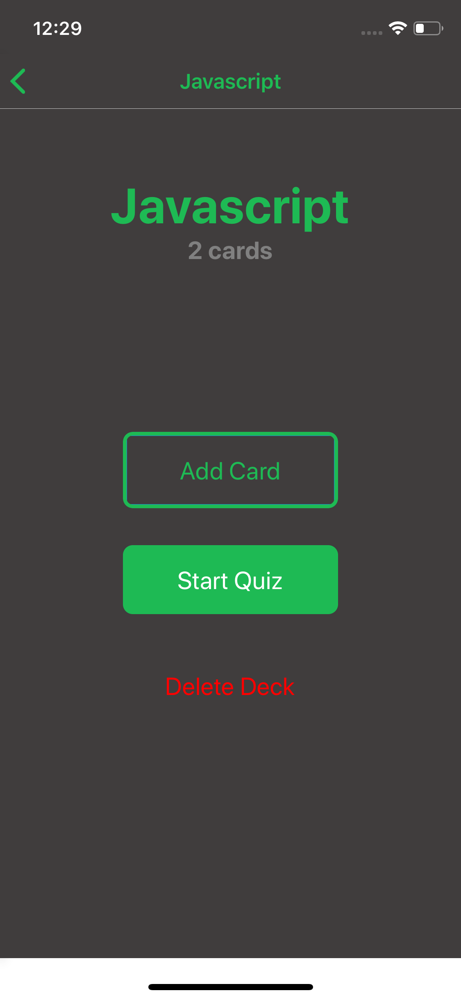

# Project : Study Decks
## By  Fouad Asharf

## Table of contents
- [Description](#description)
- [Screenshots](#screenshots)
- [How to Run Project](#how-to-run-project)
- [Tested Platforms](#tested-platforms)
- [Attribution](#attribution)
- [Copyright and license](#copyright-and-license)


## Screenshots
DeckList|Add Deck|Deck View|Add Card
:---:|:---:|:---:|:---:
|||

Quiz(question)|Quiz(answer)|Score
:---:|:---:|:---:
||

## Description
- a mobile application (Android or iOS) that allows users to study collections of flashcards. The app will allow users to create different categories of flashcards called "decks", add flashcards to those decks, then take quizzes on those decks. this project is a part of the Udacity's [React Developer Nanodegree](https://www.udacity.com/course/react-nanodegree--nd019).

- Built using [React Native](https://reactnative.dev/), [React](https://reactjs.org/), [Redux](https://redux.js.org/), [Expo](https://expo.io/), [expo/create-react-native-app](https://github.com/expo/create-react-native-app) and [React Native Elements](https://react-native-elements.github.io/react-native-elements/).


## How to Run Project
1. clone or download this repository.
      
2. run the app by using the following commands:
      1. Navigate to the project folder:
          ```
          cd reactnd-project-study-decks
          ```
      2. Install app dependancies:
          ```
          yarn install
          ```
          
      3. Start the app:
            -  Android
          ```
            yarn android
          ```
            -  IOS
          ```
            yarn ios
          ```
            -  Expo (Browser)
          ```
            yarn web
          ```

## Tested Platforms
 - Android.
 - IOS.


## Attribution
* [expo/create-react-native-app](https://github.com/expo/create-react-native-app)
* [React Native Elements](https://react-native-elements.github.io/react-native-elements/)
* [react-native-flip-card](https://github.com/moschan/react-native-flip-card)
* [react-native-flash-message](https://github.com/lucasferreira/react-native-flash-message)


## Copyright and License
- supplied without rights.

